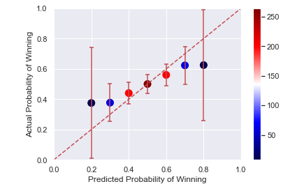
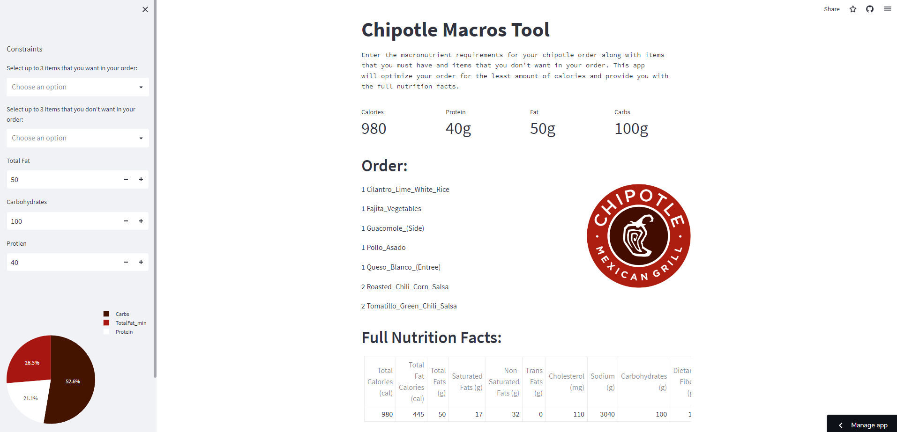

# [Fantasy Football Manager Rating](https://github.com/JohnBolger/FFMR)
- Proposed a forecasting model for my fantasy football league that combines two Elo ratings with a weighted average and regresses to the mean at the beginning of each season.
- Used the [sleeper wrapper package](https://github.com/dtsong/sleeper-api-wrapper) to retrieve my league's data from sleeper's API
- Optimized the model for a combination of percentage of games predicted total and percentage of games predicted in the 2022 season using Scipy's curve fit function and analyzing scatterplots.
- Forecasted each matchup using the previous weeks data and analyzed the model using a calibration plot and Brier skill score.

# [Chipotle Opimizer](https://github.com/JohnBolger/chipotlemacros)
- Downloaded the Chipotle nutrition facts dataset from [Kaggle](https://www.kaggle.com/datasets/brandonqilin/chipotle-usa-menu-nutrition-dataset).
- Utilized PulP's opimization functions to minimize the number of calories in an order based on a set of constraints
- Used NumPy to perform matrix multiplication and addition the calculate the nutrition facts for the optimized order.
- Built a [Streamlit web app]( https://chipotle.streamlit.app/) that allows the user to specify their macronutrient goals and enter items that want to be included or excluded from their order. The app, using the user's input, displays a pie chart with their macronutrient information, thier optimized order, and the full nutrition facts for their optimized order.

