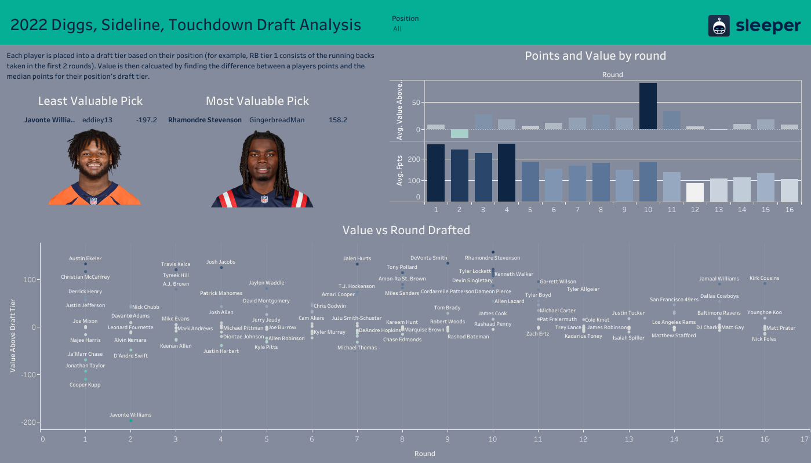

#  Project 1: [Sleeper Draft Analysis](https://github.com/JohnBolger/sleeper_draft_analysis)
- Wrote a python script that retrieves fantasy football draft data from Sleeper API, puts it in a pandas dataframe, merges it with with stats from the season, and exports the dataframe as a csv.
- Connected data to Tableau and built an [interactive dashboard](https://public.tableau.com/app/profile/john.bolger/viz/Diggs/PickAnalysis).

#  Project 2: [Chipotle Opimizer](https://github.com/JohnBolger/chipotlemacros)
- Downloaded a dataset with the full nutrition facts for Chipotle Mexican Grills in the United States from [Kaggle](https://www.kaggle.com/datasets/brandonqilin/chipotle-usa-menu-nutrition-dataset).
- Utilized PulP's optimization functions to minimize the number of calories in an order based on a set of constraints.
- Performed matrix operations with NumPy to calculate the nutrition facts for the optimized order.
- Built a [Streamlit web app]( https://chipotle.streamlit.app/) that allows the user to specify their macronutrient goals and enter items that want to be included or excluded from their order. The app, using the user's input, displays a pie chart with their macronutrient information, their optimized order, and the full nutrition facts for their optimized order.

# Project 3: [Fantasy Football Manager Rating](https://github.com/JohnBolger/FFMR)
- Proposed a forecasting model for my fantasy football league that combines two Elo ratings with a weighted average and regresses to the mean at the beginning of each season.
- Used the [sleeper wrapper package](https://github.com/dtsong/sleeper-api-wrapper) to retrieve my league's data from sleeper's API
- Optimized the model for a combination of percentage of games predicted total and percentage of games predicted in the 2022 season using Scipy's curve fit function and analyzing scatterplots.
- Forecasted each matchup using the previous weeks data and analyzed the model using a calibration plot and Brier skill score.

# Project 3.5: [Fantasy Football Manager Rating built in Excel](https://github.com/JohnBolger/FantasyFootballELO)
- I previously built my rating system in Excel utilizing VLOOKUPs and conditional formulas. Check out the full full spreedsheet [here](https://docs.google.com/spreadsheets/d/1E_rgryqYJCXCeMMF1Hy3kmoZCZJNyvGrfDCidTjGOC4/edit#gid=1467900381).
